# Directorium
*Directorium* is a *Kotlin/TornadoFX* application.

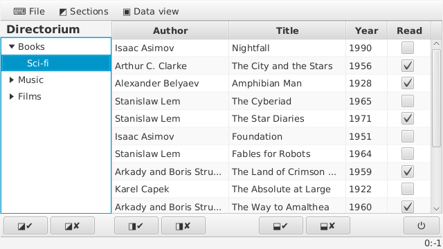

It was created as an academic project which has the following sections.

## Specification

1. Name: Directorium.
2. Purpose: store user data.
3. Functions: create, modify, store arbitrary user data schema; input, display, and print user data.
4. Structure and GUI: main menu, category/section area, data view area, tool bar, category/section create/delete dialog, table column create/delete dialog, print dialog.

## Development

1. Language: **Kotlin**.
2. Framework: **TornadoFX**.
3. Platform: **JavaFX**.
4. IDE: **IntelliJ IDEA**.
5. Build system: **Maven**.
6. Libraries: jdk8-openjdk, jre8-openjdk, java-openjfx, tornadofx, kotlin-stdlib, kotlin-test, kotlin-reflect, kotlinx-serialization-runtime.
7. Host system: **Archlinux**.

## Program structure

Modules are represented by packages. Diagram below shows project-specific packages.


Packages `directorium` and `components` are separated with build system into `directorii-nucleus` and `directorii-pars` artifacts respectively.

Contents of `directorii-nucleus`:


```
com
└── github
    └── valv
        └── directorium
            ├── app
            │   ├── Directorium.kt
            │   └── Styles.kt
            ├── control
            │   ├── Data.kt
            │   └── Events.kt
            └── view
                ├── FragmentCategoryControl.kt
                ├── FragmentCategoryTree.kt
                ├── FragmentDataViewControl.kt
                ├── FragmentDataViewPrint.kt
                ├── FragmentMainMenu.kt
                ├── FragmentToolPanel.kt
                └── ViewMain.kt
```

Contents of `directorii-pars`:

```
com
└── github
    └── valv
        └── components
            └── controls
                └── GenericCell.kt
```

Each file inside a package represents a separate class. Some classes have nested classes (marked as composition on the diagram).


Class purpose:

* _**Directorium**_ is an *App* subclass, application instance, uses *ViewMain* and *Styles*;
* _**Styles**_ is a *Stylesheet* subclass that us used by *Directorium*, provides visual effects to GUI components;
* _**GenericCell**_ is a *TableCell* subclass with extension functions that is used by *Data* class to build custom cell factories and text formatters for *TableView* in *ViewMain* class;
* _**Data**_ is a *Controller* subclass that contains main application logic, it has *Field* nested class for table view columns' metadata, provides serialization and file i/o for the application, depends on *Events* and *GenericCell*;
* _**Events**_ is a custom class (*Any* subclass by default) that contains nested classes to represent events to be sent to *MessageBus*, each of them is a *FXEvent* subclass;
* _**ViewMain**_ is a *View* subclass and is the main window class that comprises another parts of GUI as *Fragment* classes (*FragmentCategoryControl* and *FragmentDataViewControl* are created dynamically with parameters, the rest fragments are created statically), depends on *Data* and *Events*, fires events to *MessageBus*;
* _**FragmentMainMenu**_ is a *Fragment* subclass that contains main menu and its submenus, depends on *Events*, fires events to *MessageBus*;
* _**FragmentCategoryTree**_ is a *Fragment* subclass that contains pre-configured *TreeView* instance with custom cell formatter and listeners, depends on *Events*, fires events to *MessageBus*;
* _**FragmentToolPanel**_ is a *Fragment* subclass that contains tool bars with buttons analogous to main menu items for quick access, depends on *Events*, fires events to *MessageBus*;
* _**FragmentDataViewPrint**_ is a *Fragment* subclass that contains print preview dialog with another *TableView* and printer controls, depends on *Data*;
* _**FragmentCategoryControl**_ is a *Fragment* subclass that contains category/section creation/deletion dialog, depends on *Events*, fires events to *MessageBus*, takes parameters on creation;
* _**FragmentDataViewControl**_ is a *Fragment* subclass that contains field creation/deletion dialog with nested *ColumnTypes* enum class (for fixed set of available column types), depends on *Events*, fires events to *MessageBus*, takes parameters on creation.

> Classes that depend on *Events* class have *subscribers* (listeners) for *MessageBus*. All classes depend on *tornadofx* package.

> All fragments are able to run separately from the main view (that ability was used during development).

## Implementation

*TODO:* functions description (sequence diagrams).

## Users guide

### Prerequisites

Java 8 (JRE for running, JDK for building) with JavaFX platform is required to be installed in the system. Maven 3 is required for building.

### Building

Get the project:
```
$ git clone https://github.com/ValV/Directorium.git
```
Change directory:
```
$ cd Directorium
```
Call Maven to build:
```
$ mvn package
```
Target jar-archive is located in `directorii-nucleus/target/directorii-nucleus-VERSION-jar-with-dependencies.jar`. This is self-contained archive that is ready to run.

Copy target archive to any directory and call Maven to clean (if necessary):
```
$ mvn clean
```

### Running

Assuming that you have target archive `directorii-nucleus-VERSION-jar-with-dependencies.jar`, you can rename (if necessary, e.g. to `directorium.jar`) and run it:
```
$ mv directorii-nucleus-VERSION-jar-with-dependencies.jar directorium.jar
$ java -jar directorium.jar
```

### Working with Directorium

Working with *Directorium* implies creating custom data scheme. It is done by creating custom data view with arbitrary number of fields with unique name and one of the supported data types within a section.

> Data view is represented by the table view GUI component.

#### Create a section in a category

*Directorium* was developed to be simple, thus only two-level hierarchy (category/section) is supported. Any section must exist in a category, e.g. `Books/Sci-fi`. You can use main menu or tool bar buttons to create a section within a category.

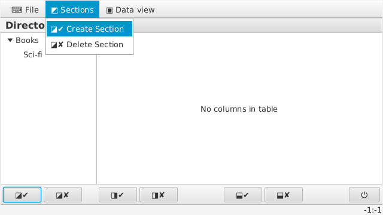

In section create dialog one can specify names for both category and a section.

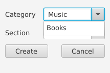

#### Add a section into a category

Adding sections is done in the same way as it is created, but choosing existing category.

#### Remove a section from a category

You can delete a section from a category via tool bar or main menu.

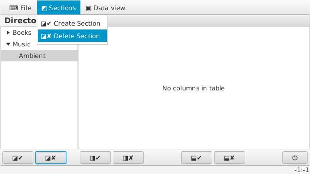

Removal dialog will appear as in case of creation.

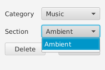

> When the last section is removed from a category, the category remains empty. This is done for convenience (not to create the same category again), but is you need to delete it as well, call the dialog again and remove the category with empty section.

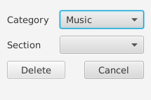

#### Add a column into the table view

Column creation also has menu and tool bar controls.

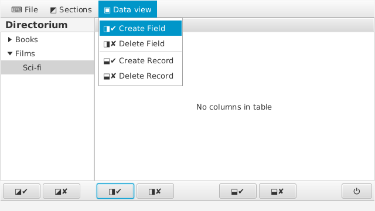

Column creation dialog is used to create column, where you can specify column name and it's data type.

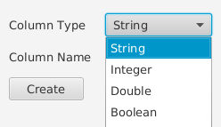

> Column name must be unique. Each column represents data field.

#### Remove a column from the table view

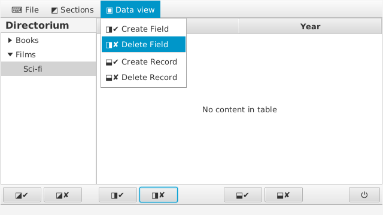

Column removal is done via the dialog as well. You must specify column name to delete.

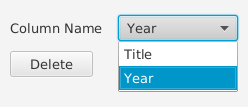

#### Add a row into the table view

Select menu item _Create Record_ or use a button with the same pictogram on the tool bar.

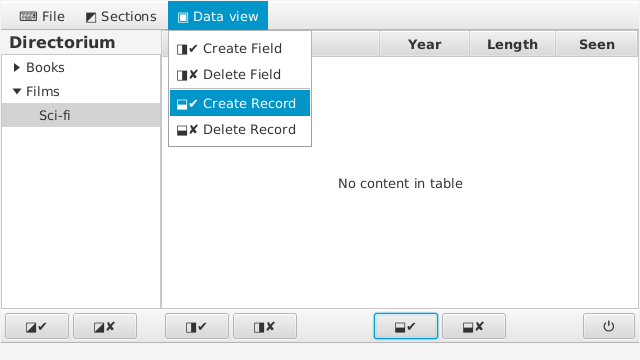

> Every new row is created next to selected one, or at the end of the table, if none is selected. Each row represents data record.

#### Remove a row from the table view

Row removal is done in the same way as its creation, but with _Delete Record_ menu item (or corresponding button on the tool bar).

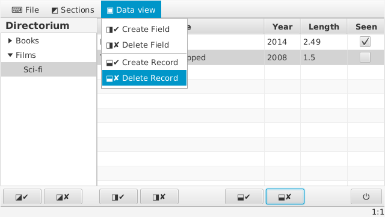

#### Print data view

Select _Print_ menu item in the main menu, the print view will be opened. Initial size of the table view inside the print view will be adjusted to *A4 portrait* layout with maximum printable area for the default printer.

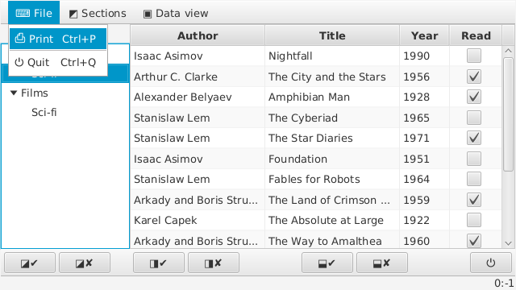

Press button with the printer pictogram on the left to send the view to the selected printer.

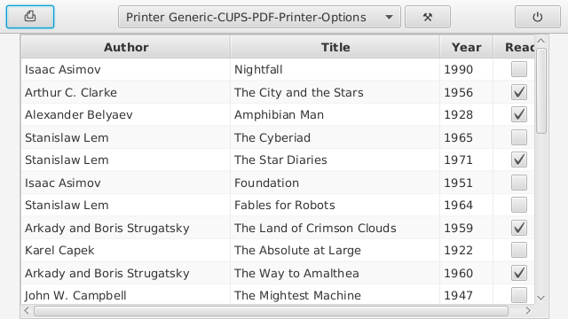

> You can select another printer device in the dropdown list in the middle (initialy it is system default printer)

> Button between printer selection list and close button allow you to configure selected printer.

Printing into PDF example [can be found in resources](resources/directorium-print.pdf).

#### Saving data

Data is saved automatically. Category/section data is saved on category/section creation/deletion or upon program exit. Data view is saved on section change or upon exit.

> If *Directorium* is terminated abnormally, some data may not be saved.

## TODO

*Directorium* is an academic project, and on the current milestone it meets all requirements. But further improvements may be done:

- [ ] Add versioning into Maven

- [ ] Add KDoc to the source

- [ ] Add multi-page print support

- [ ] Add data export / import

- [ ] Add more field data types

- [ ] Add more column factories

- [x] Add / specify *TODO*s

- [ ] Add i18n
